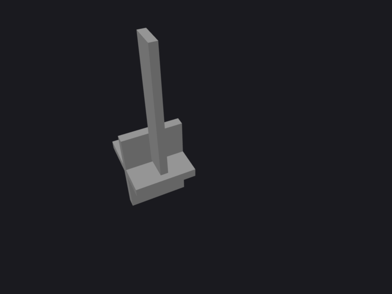

# Build your first part

We will build a **shelf bracket**: the familiar L-shaped wall support with a triangular gusset. It
exercises the core of the feature pipeline (a sketch, an extrude, a boolean union, a rib grown until
it meets material, and a datum plane) while staying small enough to read at a glance.

The full document is `examples/03-dress-up/shelf_bracket.hocon`. We build it up one feature at a time
so you can see how each op consumes the previous result.

## 1. A sketch and an extrude

Every solid starts from a 2D **sketch** placed on a plane, turned into a body by a feature like
**extrude**. Here the wall plate is a 40x60 rectangle in the YZ plane, extruded 6 mm thick:

```properties
units = mm
parts {
  shelf_bracket {
    profile = solid
    material = steel_1018
    features = [
      { id = wall_sk, op = sketch, plane = YZ,
        elements = [ { id = r, type = rectangle, w = 40, h = 60 } ] }
      { id = wall, op = extrude, profile = wall_sk, distance = 6 }
    ]
  }
}
```

`profile = solid` means this part is a solid body; `material = steel_1018` resolves from the material
library (used for mass properties and appearance). Each feature has a stable `id` that later features
reference (`op = extrude, profile = wall_sk`).

## 2. A second body, joined with a boolean

The horizontal shelf arm is a second sketch-and-extrude, then a **boolean union** fuses the two
slabs into one L-shaped solid:

```properties
      { id = arm_sk, op = sketch, plane = XY,
        elements = [ { id = ra, type = rectangle, w = 50, h = 40 } ] }
      { id = arm_ext, op = extrude, profile = arm_sk, distance = 6 }
      { id = ell, op = boolean, operation = union, target = wall, tool = arm_ext }
```

## 3. A rib grown until it meets material

The gusset is an open sketch line braced into a **rib** that grows `until` it hits the arm and wall
and auto-trims, the correct way to brace a reentrant corner (no manual boolean trim):

```properties
      { id = gusset_sk, op = sketch, plane = XZ, open = true,
        entities = [
          { id = a, type = point, at = [ 3, 8 ] }
          { id = b, type = point, at = [ 22, 8 ] }
          { id = ln, type = line, p1 = a, p2 = b }
        ]
        constraints = [ { type = fix, of = a }, { type = fix, of = b } ] }
      { id = gusset, op = rib, profile = gusset_sk, target = ell, thickness = 5, until = true }
```

## 4. A datum plane

Finally a **datum plane** offset 30 mm up the wall gives a reference for a future mounting hole:

```properties
      { id = mount_dp, op = datum_plane, method = offset, base = YZ, distance = 30 }
```

## Build it and look

```bash
ncad build examples/03-dress-up/shelf_bracket.hocon
ncad view
```

`ncad build` writes `out/parts/shelf_bracket/shelf_bracket.glb` (plus BOM, plan, and element-map
sidecars); `ncad view` serves the browser viewer at http://127.0.0.1:8000 where you can orbit the
result:

{ width="360" }

## Edit and rebuild

The document is the model. Change the arm length and rebuild, and the part follows deterministically:
edit `arm_sk`'s rectangle `w = 50` to `w = 70`, run `ncad build` again, and the shelf grows while the
gusset still braces the corner (it is grown `until` material, not a fixed size). That is the whole
loop: edit the text, replay, view.

Next: [compose two parts into an assembly](first-assembly.md).
